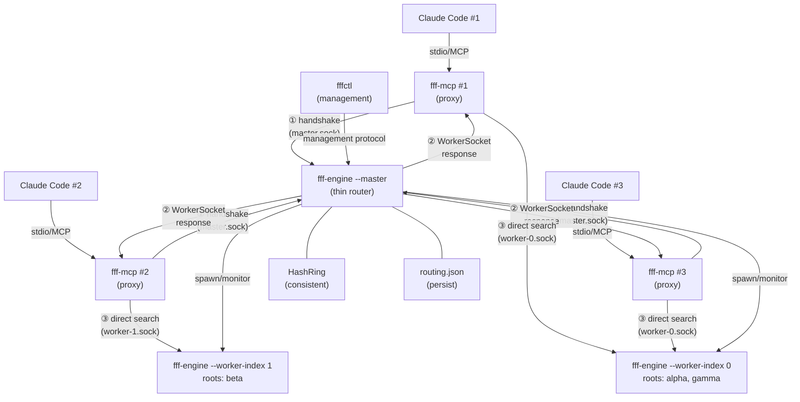
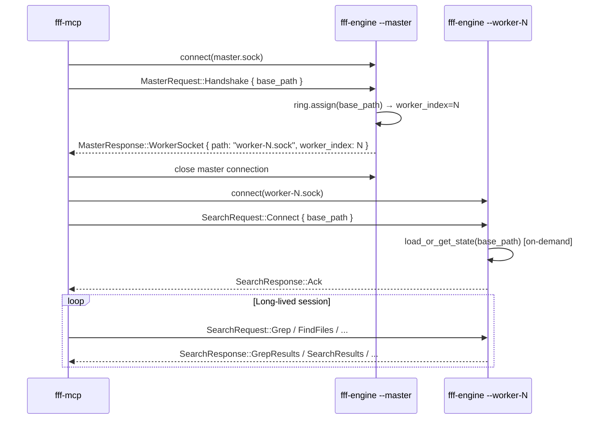
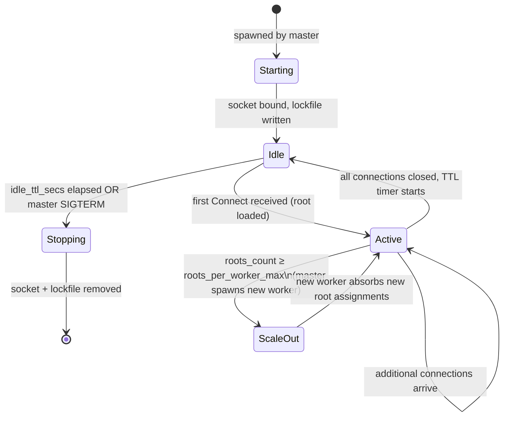

# feat: fff-engine Master + Sharded Worker Model

**Plan date:** 2026-06-08
**Depth:** Deep
**Origin:** `docs/brainstorms/2026-06-08-fff-engine-worker-model-requirements.md`
**Predecessor plan:** `docs/plans/2026-06-05-001-feat-fff-engine-singleton-daemon-plan.md`

---

## Problem Frame

The existing singleton `fff-engine` model (one OS process per project root) has no global resource cap, no unified lifecycle entry point, and no CPU fairness across roots. When many roots are active simultaneously, total Rayon thread pools and memory footprints multiply unchecked.

This plan implements the **master + sharded worker model** described in the requirements doc: a single thin master process routes `fff-mcp` connection handshakes to N OS-process workers; workers own stable root shards via consistent hashing and handle all search traffic directly.

---

## Requirements Trace

| Req | Requirement | Units |
|-----|-------------|-------|
| R1 | One master process as the well-known entry point | U4 |
| R2 | Workers are OS processes with hash-assigned root shards | U2, U3 |
| R3 | Two-phase connect: master handshake → direct worker socket | U1, U4, U7 |
| R4 | Dynamic scale-out up to N_max workers | U5 |
| R5 | R1 crash recovery: routing.json persist + auto-respawn | U6 |
| R6 | fff-ctl: master socket targeting, list-workers, worker-status | U8 |
| R7 | BigramFilter stays per-worker-heap (no cross-process sharing) | U3 |

*(see origin: `docs/brainstorms/2026-06-08-fff-engine-worker-model-requirements.md`)*

---

## Key Technical Decisions

**KTD-1 — Single binary with mode flags, not separate crates.**
`fff-engine` gains `--master` and `--worker-index N` flags. Worker mode: worker process is a re-exec of the same binary with `--worker-index N`. Simpler packaging, single install artifact, and fffctl can introspect both master and workers via the same binary and management protocol.

**KTD-2 — Consistent hash ring built on blake3 (no new crate).**
Blake3 is already in the workspace (`paths.rs` uses it for slug derivation). The ring implementation lives in `crates/fff-engine/src/ring.rs` — roughly 100 lines of virtual-node ring arithmetic. No new workspace dependency.

**Re-shard policy — routing table lifetime equals in-memory lifetime; ring handles misses.**

The routing table and the hash ring serve two distinct roles:

- **Hash ring**: determines *which worker* a new root should go to. Consulted only when a slug has no routing table entry.
- **Routing table** (`routing.json`): tracks *currently loaded* roots — `slug → worker_index`. An entry exists while the slug is resident in that worker's in-memory registry. It is written on first load and removed when the worker LRU-evicts the slug from memory.

**Why lifetime must match in-memory state:** Using a permanent routing table (assignments that only clear on worker death) causes the assignment count per worker to grow monotonically. After enough LRU evictions, master's view of worker load stays perpetually "full" even when workers have headroom, eventually exhausting `N_max` prematurely.

**Active-connection guard:** A root with live `fff-mcp` connections holds `Arc::strong_count > 1` (registry + each connection). LRU may only evict a slug when `strong_count == 1` (registry-only — no connections). This guarantees that any active session's root stays in the routing table for its full lifetime, so concurrent sessions on the same root always route to the same worker.

**Communication model — all channels are one-directional:**

| From | To | Mechanism | Direction |
|------|----|-----------|-----------|
| fff-mcp | Master | Unix socket (Handshake / management) | Request → Response |
| fff-mcp | Worker | Unix socket (Connect + search) | Request → Response |
| Worker | Master | `MasterRequest::EvictedRoot` fire-and-forget | One-way, no response |
| Master | Worker | SIGTERM | OS signal, no socket |

No persistent bi-directional channel exists between master and any worker. Crash detection uses `child.try_wait()` (OS mechanism). The `EvictedRoot` notification follows the same fire-and-forget pattern as `RecordAccess` in the existing design — worker connects to master socket, sends the message, closes.

**KTD-3 — Worker sockets in a dedicated `workers/` subdirectory.**
Worker sockets are `<xdg_cache>/fff/workers/worker-{N}.sock`. Separating from the existing `sockets/` (per-root slug convention) avoids naming collision and makes worker artifacts easily discoverable by fffctl.

**KTD-4 — Master management protocol via extended `MasterRequest` / `MasterResponse`.**
Adding `ListWorkers`, `WorkerStatus { index }`, and `StopWorker { index }` variants to the master request/response types avoids a separate admin socket. fffctl sends these over the standard master socket using the same bincode-framed codec.

**KTD-5 — Worker connection setup via `SearchRequest::Connect { base_path }`.**
When fff-mcp connects to a worker socket, it sends a new `SearchRequest::Connect { base_path }` as the first message. Worker loads state for that root on demand (first access triggers `state::init`) and responds with `SearchResponse::Ack`. Normal search traffic follows. This reuses the existing codec and avoids a separate handshake protocol for the worker leg.

**KTD-6 — Worker state: multi-root registry, on-demand loading.**
Each worker maintains `HashMap<slug, Arc<EngineState>>` protected by `Arc<RwLock<...>>`. On `Connect { base_path }`, the worker looks up the slug; if absent, initialises a new `EngineState` (full scan + FS watcher). The connection holds an `Arc<EngineState>` clone for its lifetime. When all connections for a root close, the `Arc` refcount drops to the registry — root state persists in the worker for subsequent connections without re-scanning.

**KTD-7 — xdg_runtime_dir() falls back to xdg_cache_dir() on macOS.**
macOS does not set `$XDG_RUNTIME_DIR`. `fff-ipc` gains `xdg_runtime_dir()` that falls back to `xdg_cache_dir()` when the env var is absent. Routing table (`routing.json`) lives under the runtime dir.

**KTD-8 — LMDB (Lightning Memory-Mapped Database) write safety: no coordination needed.**
Each root has its own LMDB environment at a unique per-slug path. Workers own disjoint root sets (hash-shard assignment). No two workers share the same LMDB environment. No write coordination protocol is needed.

**KTD-9 — Worker spawning uses `Command::new` (not fork).**
Tokio's async runtime does not survive `fork(2)`. Workers are spawned as fresh OS processes via `std::process::Command` with `--worker-index N` only. No `--base-path` is passed — workers are root-agnostic at startup; roots are loaded on demand when connections arrive.

---

## High-Level Technical Design

### Component Topology



### Handshake Sequence



### Worker State Machine



### Consistent Hash Ring

```
Virtual nodes per worker (e.g., 150):

    ──────────────────────── ring ──────────────────────────
    │  w0v0  │  w1v12 │  w0v47 │  w1v83 │  w0v99 │ w1v134 │ ...
    
  assign(base_path):
    point = blake3(canonical_path) mod RING_SIZE
    walk clockwise → first virtual node → owner worker index
```

---

## Output Structure

```
crates/fff-engine/src/
├── main.rs           (extend: --master / --worker-index flags)
├── master.rs         (new: master process loop, routing table, worker spawning)
├── ring.rs           (new: consistent hash ring on blake3)
├── worker.rs         (new: worker process loop, multi-root state registry)
├── server.rs         (extend: handle SearchRequest::Connect variant)
├── state.rs          (unchanged)
├── handlers.rs       (unchanged)
└── lifecycle.rs      (unchanged)

crates/fff-ipc/src/
├── types.rs          (extend: MasterRequest, MasterResponse, SearchRequest::Connect)
├── paths.rs          (extend: master/worker path helpers, xdg_runtime_dir)
├── config.rs         (extend: WorkerConfig, FffConfig::worker)
└── routing.rs        (new: RoutingTable, WorkerEntry, JSON serialization)

crates/fff-mcp/src/
├── client.rs         (rewrite connect: two-phase handshake)
└── recovery.rs       (extend: master respawn path)

crates/fff-ctl/src/
└── main.rs           (extend: list-workers, worker-status, master-aware stop)
```

---

## Implementation Units

### U1. fff-ipc — Protocol and Path Foundations

**Goal:** Add all new wire types, path helpers, and config that every other unit depends on. No logic beyond (de)serialization and path construction.

**Requirements:** R1, R2, R3, R4, R5, R6

**Dependencies:** None — this is the foundation layer.

**Files:**
- `crates/fff-ipc/src/types.rs`
- `crates/fff-ipc/src/paths.rs`
- `crates/fff-ipc/src/config.rs`
- `crates/fff-ipc/src/routing.rs` *(new)*
- `tests/fff_ipc_types_test.rs` *(or inline `#[cfg(test)]` module)*

**Approach:**

*types.rs — additions:*
- Extend `SearchRequest` with `Connect { base_path: String }` variant (worker connection setup, first message on worker socket)
- Add `MasterRequest` enum: `Handshake { base_path: String }`, `ListWorkers`, `WorkerStatus { index: u32 }`, `StopWorker { index: u32 }`, `EvictedRoot { slug: String }` (fire-and-forget from worker, no response)
- Add `MasterResponse` enum: `WorkerSocket { path: String, worker_index: u32 }`, `WorkerList { workers: Vec<WorkerInfo> }`, `WorkerInfo { index: u32, socket_path: String, root_slugs: Vec<String>, root_count: usize, pid: u32 }`, `Ack`, `Error(String)`
- All new types derive `Debug, Clone, Serialize, Deserialize`

*paths.rs — additions:*
- `xdg_runtime_dir()`: returns `$XDG_RUNTIME_DIR` if set, else falls back to `xdg_cache_dir()`
- `master_socket_path()` → `<xdg_cache>/fff/master.sock`
- `master_lockfile_path()` → `<xdg_cache>/fff/master.lock`
- `worker_socket_path(index: u32)` → `<xdg_cache>/fff/workers/worker-{index}.sock`
- `worker_lockfile_path(index: u32)` → `<xdg_cache>/fff/workers/worker-{index}.lock`
- `routing_table_path()` → `<xdg_runtime_dir>/fff/routing.json`

*config.rs — additions:*
- `WorkerConfig { n_min: u32, n_max: u32, roots_per_worker_max: u32, idle_ttl_secs: u64 }` with `Default` impl (n_min=1, n_max=4, roots_per_worker_max=8, idle_ttl_secs=300)
- Add `worker: WorkerConfig` field to `FffConfig`

*routing.rs (new):*
- `RoutingTable { ring_state: SerializableRing, workers: HashMap<u32, WorkerEntry> }` — ring state and worker index → WorkerEntry
- `WorkerEntry { index: u32, socket_path: String, pid: u32, root_slugs: Vec<String> }`
- `serde_json` serialization; `RoutingTable::load(path)` and `RoutingTable::save(path)`

**Patterns to follow:** Existing `types.rs` round-trip tests; `paths.rs` convention (no side effects, pure path construction); `config.rs` `Default` impl pattern with `#[serde(default)]`.

**Test scenarios:**
- `MasterRequest::Handshake` round-trips through bincode serialize → deserialize without data loss
- `MasterResponse::WorkerSocket` round-trips
- `MasterResponse::WorkerList` with multiple `WorkerInfo` entries round-trips
- `SearchRequest::Connect` round-trips
- `xdg_runtime_dir()` returns the env var value when set
- `xdg_runtime_dir()` falls back to cache dir when `$XDG_RUNTIME_DIR` is not set
- `worker_socket_path(0)` and `worker_socket_path(9)` produce paths under `workers/` subdirectory
- `routing_table_path()` produces a path under the runtime dir
- `RoutingTable` serializes to valid JSON and deserializes back to identical value
- `WorkerConfig::default()` produces n_min=1, n_max=4, roots_per_worker_max=8, idle_ttl_secs=300
- `FffConfig` with `[worker]` section in TOML deserializes `WorkerConfig` fields correctly
- `FffConfig` without `[worker]` section uses `WorkerConfig::default()`

**Verification:** All existing `fff-ipc` tests still pass. New types compile and round-trip. `make test` green.

---

### U2. Consistent Hash Ring

**Goal:** Implement a virtual-node consistent hash ring in `fff-engine` using blake3. The ring maps a `base_path` to a stable worker index and supports adding/removing workers with minimal reassignment.

**Requirements:** R2

**Dependencies:** U1 (for `base_path_slug` convention and `SerializableRing` type referenced by RoutingTable)

**Files:**
- `crates/fff-engine/src/ring.rs` *(new)*
- `crates/fff-ipc/src/routing.rs` *(extend: add `SerializableRing`)*

**Approach:**

- `HashRing` struct: sorted `Vec<(u64, u32)>` of (ring point, worker_index) virtual nodes. Ring space is `u64::MAX`.
- `HashRing::assign(&self, base_path: &Path) -> Option<u32>`: hashes canonical path bytes with blake3, takes low 8 bytes as u64 ring point, binary-searches for the next clockwise virtual node, returns its worker index. Returns `None` when ring is empty.
- `HashRing::add_worker(&mut self, index: u32, virtual_nodes: usize)`: generates `virtual_nodes` points by hashing `blake3(format!("worker-{index}-vnode-{i}"))` for i in 0..virtual_nodes, inserts into sorted vec, deduplicates. Default virtual node count: 150.
- `HashRing::remove_worker(&mut self, index: u32)`: drains all virtual nodes owned by that index.
- `HashRing::workers(&self) -> Vec<u32>`: unique worker indices currently in the ring.
- `HashRing::len(&self) -> usize`: total virtual nodes (not unique workers).
- Serializable: `SerializableRing` newtype wrapping the sorted vec; used in `RoutingTable`.

**Patterns to follow:** Existing use of `blake3` in `crates/fff-ipc/src/paths.rs`.

**Test scenarios:**
- `assign` on empty ring returns `None`
- After `add_worker(0, 150)`, `assign` on any path returns `Some(0)`
- After `add_worker(0, 150)` and `add_worker(1, 150)`, both worker indices appear across a sample of 100 paths (probabilistic balance — assert both appear at least once)
- Removing a worker removes all its virtual nodes from the ring
- `assign` is stable: same path returns the same worker before and after unrelated workers are added/removed from non-adjacent ring segments (test with a known path and verify it stays on worker 0 when worker 2 is added on the opposite ring arc)
- Serializing `HashRing` → `SerializableRing` → JSON → deserialize → same `assign` results for a fixed path set

**Verification:** `make test` green. `ring.assign` is deterministic across process restarts for the same ring configuration.

---

### U3. fff-engine Worker Mode

**Goal:** Implement the worker process loop. A worker accepts connections, handles `SearchRequest::Connect` to associate a connection with a root, loads root state on demand, and dispatches search requests to the correct per-root `EngineState`.

**Requirements:** R2, R7

**Dependencies:** U1, U2 (ring is used by master to route; worker itself doesn't use ring — it accepts whatever roots land on it)

**Files:**
- `crates/fff-engine/src/main.rs` *(extend: `--worker-index N` flag routing)*
- `crates/fff-engine/src/worker.rs` *(new: worker loop, multi-root registry)*
- `crates/fff-engine/src/state.rs` *(verify multi-root init works; no structural changes expected)*

**Approach:**

*Worker mode entry (`main.rs`):*
When `--worker-index N` is present, call `worker::run(index, config)` instead of `server::run()`.

*`WorkerState` struct (`worker.rs`):*
```
WorkerState {
    index: u32,
    roots: Arc<RwLock<HashMap<String, Arc<EngineState>>>>,
    // slug (blake3 hex16 of canonical path) → loaded EngineState
}
```

*Worker socket loop:*
- Bind `worker_socket_path(index)`, write `worker_lockfile_path(index)` with own PID
- Accept loop (Tokio `UnixListener`, same structure as `server::run`)
- Each accepted connection: spawn `handle_worker_connection(stream, worker_state.clone())`

*Per-connection setup (`handle_worker_connection`):*
1. Read first message: must be `SearchRequest::Connect { base_path }` — any other first message → close connection
2. Compute slug from `base_path` using `fff_ipc::base_path_slug`
3. Read-lock `roots`; if slug present, clone `Arc<EngineState>`
4. If absent: upgrade to write-lock, call `state::init(&EffectiveArgs { base_path, ... })`, insert, clone `Arc<EngineState>`
5. Write `SearchResponse::Ack`
6. Proceed to existing request loop using the connection-bound `Arc<EngineState>`

*Concurrency note:* State loading (`state::init`) is blocking (opens LMDB, starts FS watcher, triggers async FilePicker scan). Use `tokio::task::spawn_blocking` for the init call; acquire write-lock only to insert the completed state, not during the blocking init itself (avoid holding the lock while the scan runs). Use a per-slug loading mutex or a `DashMap`-style approach to prevent concurrent init for the same slug.

*SIGTERM handler:* On shutdown, remove worker socket and lockfile (same pattern as existing `server::run`).

**Patterns to follow:** `crates/fff-engine/src/server.rs` `handle_connection` pattern; `crates/fff-engine/src/state.rs::init`; `spawn_blocking` with `parking_lot::RwLockReadGuard` (the guard is not `Send` — all result projection must happen inside `spawn_blocking`).

**Test scenarios:**
- Worker binds its socket file at `worker_socket_path(N)` on startup
- A connection that sends `Grep { ... }` as the first message (skipping `Connect`) is rejected (connection closed, no crash)
- A connection that sends `Connect { base_path: valid_path }` receives `Ack`
- A second connection for the same `base_path` receives `Ack` without triggering a second `state::init` call (registry hit; assert init called only once)
- Two concurrent connections for the same `base_path` do not both trigger `state::init` (only one init, both get `Ack`)
- A connection for `base_path` A followed by a connection for `base_path` B both get independent `EngineState` instances
- After `Connect`, a `FindFiles` request returns `SearchResults`
- Worker cleans up socket and lockfile files on shutdown (SIGTERM)

**Verification:** Worker process starts, binds socket, accepts connections, serves search requests, exits cleanly on SIGTERM. No stale socket files after shutdown.

---

### U4. fff-engine Master Mode

**Goal:** Implement the master process: routing table management, consistent hash ring, worker spawning on startup, master socket server, and management protocol for fffctl.

**Requirements:** R1, R3, R4, R6 (spawn side)

**Dependencies:** U1, U2, U3

**Files:**
- `crates/fff-engine/src/main.rs` *(extend: `--master` flag routing)*
- `crates/fff-engine/src/master.rs` *(new: master loop, routing table, worker spawning, management protocol)*

**Approach:**

*Master mode entry (`main.rs`):*
When `--master` is present, call `master::run(config)`.

*Master startup sequence:*
1. `O_CREAT|O_EXCL` on `master_lockfile_path()` — race for spawn authority; losers exit cleanly
2. Write own PID to master lockfile
3. Load routing table from `routing_table_path()` if it exists:
   - For each worker entry: probe PID with `kill(pid, 0)` — if alive, retain entry; if dead, drop entry
   - Surviving workers are reconnected to the ring (ring state restored from `RoutingTable::ring_state`)
4. Spawn N_min − (surviving_worker_count) new workers (each as `Command::new(current_exe()).args(["--worker-index", &index.to_string()]).stdin(Stdio::null()).stdout(Stdio::null()).stderr(Stdio::null()).spawn()`)
5. Track spawned workers: `HashMap<u32, Child>` for process monitoring
6. Bind master socket at `master_socket_path()`
7. Enter accept loop

*Master accept loop:*
- On `MasterRequest::Handshake { base_path }`:
  - `ring.assign(&base_path)` → worker_index
  - Respond with `MasterResponse::WorkerSocket { path: worker_socket_path(worker_index), worker_index }`
  - Note: if ring is empty or all workers are full, respond with `Error("no workers available")`
- On `MasterRequest::ListWorkers`:
  - Collect worker entries from routing table
  - Respond with `MasterResponse::WorkerList { workers }`
- On `MasterRequest::WorkerStatus { index }`:
  - Look up entry, probe PID liveness
  - Respond with `MasterResponse::WorkerInfo { ... }`
- On `MasterRequest::StopWorker { index }`:
  - Send SIGTERM to worker PID, remove from ring and routing table
  - Respond with `MasterResponse::Ack`
- Master connections are short-lived (one request → one response → close); no persistent master connection

*Routing table persistence:*
After every mutation (worker spawned, worker removed, ring updated), call `routing_table.save(routing_table_path())`. This is a synchronous JSON write on the Tokio blocking pool (`tokio::task::spawn_blocking`).

*Worker process monitoring:*
Use `tokio::process::Child` (if spawning via `tokio::process::Command`) or poll via `child.try_wait()` in a Tokio `interval` task. On worker exit: log the crash, attempt restart (see U6).

**Patterns to follow:** `crates/fff-engine/src/lifecycle.rs` (lockfile acquisition pattern, `LockfileGuard` RAII); `crates/fff-mcp/src/client.rs` `wait_for_socket` poll pattern (for waiting on worker socket readiness after spawn); `crates/fff-engine/src/server.rs` accept loop.

**Test scenarios:**
- Master writes its PID to `master_lockfile_path()` on startup
- Master binds socket at `master_socket_path()`
- A second master instance attempting to start exits cleanly (lockfile already held by live process)
- `Handshake` with a valid base_path returns `WorkerSocket` response pointing to a real worker socket path
- `Handshake` when ring is empty returns `Error`
- `ListWorkers` returns all currently registered workers
- `WorkerStatus` for a live worker returns `WorkerInfo` with a valid PID
- Routing table JSON is written to disk after a worker is spawned
- Master startup reads routing.json and skips dead-PID workers (simulate stale entry: write routing.json with a dead PID, start master, assert that worker is not in the active list)
- Master cleans up master socket and lockfile on SIGTERM

**Verification:** Master starts, spawns N_min workers, accepts handshake requests, responds with correct worker socket paths. Routing table persisted to disk.

---

### U5. Dynamic Scale-Out and Worker Lifecycle

**Goal:** Implement the scale-out trigger (spawn new worker when a shard is full), idle TTL worker shutdown, and LRU root eviction when all workers are at capacity.

**Requirements:** R4

**Dependencies:** U3, U4

**Files:**
- `crates/fff-engine/src/master.rs` *(extend: scale-out logic, idle TTL, EvictedRoot handler)*
- `crates/fff-engine/src/worker.rs` *(extend: LRU eviction with EvictedRoot notification)*

**Approach:**

Routing table entry lifetime equals in-memory lifetime (see KTD-2). The routing table entry count per worker is therefore always accurate — it reflects how many roots are *currently loaded* in that worker, not historical assignments.

*Scale-out trigger (master-side):*
After each Handshake that results in a routing table miss (new slug, not yet assigned to any worker):
- Assign to the ring's chosen worker; write routing table entry; persist
- If `routing_table.entries_for_worker(index).len() >= roots_per_worker_max` and `total_workers < n_max`:
  - Spawn a new worker; add to ring; update routing table; persist
  - Future ring misses may resolve to the new worker

*LRU eviction (worker-side):*
When a new `Connect { base_path }` arrives and `registry.len() >= roots_per_worker_max`:
1. Find the eviction candidate: slug with `Arc::strong_count == 1` (registry-only, no active connections) and lowest recent-access rank
2. If a candidate exists: drop it from the registry; send `MasterRequest::EvictedRoot { slug }` fire-and-forget to master socket (connect → send → close, no response read); then load the new root
3. If no candidate (all roots have active connections): load the new root anyway — temporary overflow; no eviction, no notification

*EvictedRoot handler (master-side):*
On receiving `MasterRequest::EvictedRoot { slug }`: remove that slug's routing table entry; persist. The slug returns to the ring on the next Handshake.

*Idle TTL (master-side):*
- Periodic `tokio::time::interval` task (every 60 seconds)
- For each worker: if `routing_table.entries_for_worker(index).is_empty()` for longer than `idle_ttl_secs`, send SIGTERM
- On worker termination: remove all remaining routing table entries for that worker; persist

**Patterns to follow:** Tokio interval task pattern; `Arc::strong_count` as eviction guard; fire-and-forget socket pattern from existing `RecordAccess` in `crates/fff-mcp/src/client.rs`.

**Test scenarios:**
- New-slug Handshake writes a routing table entry; a second Handshake for the same slug is a routing table hit and returns the same worker without writing
- Scale-out fires when routing table entry count for a worker reaches `roots_per_worker_max` on a new-slug Handshake; new slug routes to the new worker
- After scale-out, existing routing entries are not remapped; second Handshake for an already-assigned root still returns the original worker
- LRU eviction: worker at capacity with a candidate (refcount == 1) evicts it, notifies master; master removes the routing table entry; next Handshake for the evicted slug is a miss and routes via ring (may return same or different worker)
- Active-connection guard: a root with live connections (refcount > 1) is not evicted even when worker is at capacity; new root loads with temporary overflow, no notification sent
- Lost `EvictedRoot` notification (simulate by dropping the message): master retains a stale routing table entry; next Handshake for that slug routes to the same worker; worker cold-starts it on `Connect`; correctness preserved
- Idle TTL: a worker with no routing table entries for `idle_ttl_secs` receives SIGTERM and is removed from ring and routing table
- Routing table is persisted after each mutation (new entry, eviction removal, worker removal)

**Verification:** Start master with N_min=1, roots_per_worker_max=2, n_max=3. Issue Handshakes for 3 distinct roots — assert 2 workers spawned; roots 1–2 on worker-0, root-3 on worker-1. Issue Handshake for root-4 targeting worker-0's shard while root-1 has an active connection — assert root-2 is evicted (no connection), routing table entry for root-2 removed, root-4 loaded on worker-0. Assert root-1 remains (active connection guard).

---

### U6. R1 Crash Recovery

**Goal:** Implement the R1 resilience model: routing.json survives master crash; fff-mcp races to respawn master on `ECONNREFUSED`; master respawn reconnects surviving workers; crashed workers are restarted by master.

**Requirements:** R5

**Dependencies:** U3, U4, U5

**Files:**
- `crates/fff-engine/src/master.rs` *(extend: worker crash detection + restart)*
- `crates/fff-mcp/src/recovery.rs` *(extend: master respawn path)*
- `crates/fff-mcp/src/client.rs` *(extend: ECONNREFUSED on master triggers respawn)*

**Approach:**

*Worker crash detection (master-side):*
Use `tokio::process::Child::wait()` or a periodic `child.try_wait()` poll. On worker exit detected:
1. Log crash with worker index and PID
2. Remove stale worker socket file if it still exists
3. Respawn worker at the same index: `Command::new(current_exe()).args(["--worker-index", &index.to_string()])...`
4. Update routing table entry with new PID, persist
5. Wait for new worker socket to appear (poll `worker_socket_path(index)` existence, 50ms intervals, 10s timeout — same pattern as `fff-mcp`'s `wait_for_socket`)

*Master respawn (fff-mcp-side, `recovery.rs`):*
Current `recovery.rs` handles engine respawn. Extend to handle master respawn:
- On `ECONNREFUSED` or `BrokenPipe` when connecting to master socket:
  1. Check master lockfile: if live PID exists, wait 200ms and retry (master may be mid-restart)
  2. If no lockfile or stale PID: race via `O_CREAT|O_EXCL` on `master_lockfile_path()` to win spawn authority
  3. Winner: spawn `fff-engine --master` as a detached process
  4. Wait for master socket to appear (50ms intervals, 10s timeout)
  5. Retry handshake

*fff-mcp on worker socket broken pipe:*
- Current `search_with_recovery` calls `recovery::respawn(engine)`. In worker model:
  1. On `BrokenPipe` or `ECONNREFUSED` on worker socket: clear the stored worker client
  2. Re-run the two-phase handshake (connect master → get new worker socket → connect to worker)
  3. Retry the original search request (up to 3 attempts with exponential backoff)

**Patterns to follow:** `crates/fff-mcp/src/recovery.rs` existing backoff (100 → 200 → 400 ms); `crates/fff-mcp/src/client.rs` `wait_for_socket`; `crates/fff-ipc/src/lockfile.rs` `O_CREAT|O_EXCL` race.

**Test scenarios:**
- fff-mcp on `ECONNREFUSED` from master: one instance wins the respawn race, others wait for master socket, all eventually connect successfully
- Two fff-mcp instances racing to respawn master simultaneously: exactly one spawns master (lockfile race), the other waits
- Worker crash detected by master (simulate: kill worker process externally): master restarts worker at same index within 10 seconds
- fff-mcp on broken worker socket: re-runs two-phase handshake, gets new worker socket, retries search, returns correct results
- Routing table JSON written before and after worker crash recovery reflects updated PID for the restarted worker
- Master startup with routing.json containing a mix of live and dead PIDs: live workers are reconnected, dead ones are respawned

**Verification:** Kill master process externally. Within 500ms, a new fff-mcp connection attempt respawns master and completes the handshake. Kill a worker process externally. Master detects exit and restarts the worker within 10 seconds. fff-mcp connected to the dead worker socket recovers transparently.

---

### U7. fff-mcp Two-Phase Connect

**Goal:** Rewrite `EngineClient::connect` to implement the two-phase handshake: connect to master, receive worker socket path, connect to worker, send `Connect { base_path }`, receive `Ack`. All search traffic thereafter uses the direct worker connection.

**Requirements:** R3

**Dependencies:** U1, U4 (master socket must exist)

**Files:**
- `crates/fff-mcp/src/client.rs`

**Approach:**

*`EngineClient` struct changes:*
- Add field: `master_socket_path: PathBuf` (for respawn and recovery — used by recovery.rs)
- Add field: `base_path: PathBuf` (for `Connect` re-send after reconnect)
- Existing `BufReader<UnixStream>` + `BufWriter<UnixStream>` fields become the worker connection

*`EngineClient::connect(base_path: &Path) -> Result<Self, ...>`:*
1. Connect to `master_socket_path()` (synchronous `UnixStream::connect`)
2. Send `MasterRequest::Handshake { base_path: base_path.to_string_lossy().into() }` via sync codec (`write_message_sync`)
3. Read `MasterResponse` via `read_message_sync`
4. If `WorkerSocket { path, .. }`: close master connection, proceed to step 5. If `Error(msg)`: return error.
5. `wait_for_socket(&path, 10s)` — poll until worker socket exists (worker may still be starting)
6. `UnixStream::connect(&path)` — establish direct worker connection
7. Send `SearchRequest::Connect { base_path: base_path.to_string_lossy().into() }` to worker
8. Read `SearchResponse` — expect `Ack`; any other response → return error
9. Return `EngineClient` with worker connection established

*Master spawn (if master unreachable):*
Before step 1, if master socket does not exist: attempt to spawn master using the same `O_CREAT|O_EXCL` race as today's engine spawn. This integrates with U6's respawn logic.

*`search_with_recovery` unchanged at the call sites* — only the underlying connection mechanics change.

**Patterns to follow:** Existing `EngineClient::connect` in `client.rs`; `wait_for_socket` pattern; `write_message_sync` / `read_message_sync` from `fff-ipc/src/codec.rs`; `Command::new` spawn with stdio nulled (`Stdio::null()`).

**Test scenarios:**
- `connect(base_path)` to a running master returns a connected `EngineClient` with a live worker socket
- `connect(base_path)` when master is not running: spawns master, waits for socket, then completes handshake
- `connect(base_path)` when master returns `Error`: propagates error to caller
- After `connect`, `send_request(FindFiles { query: "main" })` returns `SearchResults` (integration: requires live worker)
- Calling `connect` twice for the same `base_path` returns connections to the same worker socket path (idempotent routing)
- Calling `connect` for two different roots in different shards returns different worker socket paths

**Verification:** fff-mcp starts, completes two-phase handshake with master, receives `Ack` from worker, serves MCP tool calls. All existing MCP tool tests pass with the new connection path.

---

### U8. fff-ctl Management Surface

**Goal:** Update fffctl to target the master socket for all management operations. Add `list-workers` and `worker-status` subcommands. Update `stop` to terminate master (which propagates shutdown to workers).

**Requirements:** R6

**Dependencies:** U1, U4

**Files:**
- `crates/fff-ctl/src/main.rs`

**Approach:**

*Master client helper:*
Synchronous `UnixStream` connection to `master_socket_path()`, sends `MasterRequest`, reads `MasterResponse` via `read_message_sync` / `write_message_sync` codec.

*Subcommand changes:*
- `list` → replaces lockfile scanning with `MasterRequest::ListWorkers`; displays master PID (from master lockfile), worker count, each worker's index, socket path, root count, root slugs
- `status <base-path>` → `MasterRequest::Handshake { base_path }` (dry-run equivalent: reports which worker would serve this root, whether worker is alive)
- `stop [--all | <base-path>]`:
  - `--all`: SIGTERM master (master propagates SIGTERM to all workers before exiting)
  - `<base-path>`: `MasterRequest::StopWorker { index: ring.assign(base_path) }` — gracefully stop one worker
- `worker-status <index>` *(new)*: `MasterRequest::WorkerStatus { index }` → display `WorkerInfo`
- `paths` → add master socket path and routing table path to the output

*Backward compatibility:* If master socket is not found (not running), fall back to scanning individual lockfiles (legacy per-root engine mode). Display a warning noting the master is not active.

**Patterns to follow:** Existing `fffctl` subcommand structure; `fff-ipc` codec sync API.

**Test scenarios:**
- `fffctl list` with master running: displays master and worker entries (no crash, correct count)
- `fffctl list` with master not running: displays fallback message or legacy lockfile scan output
- `fffctl worker-status 0` with worker 0 running: displays WorkerInfo including PID and root slugs
- `fffctl stop --all`: sends SIGTERM to master; verify master and workers both exit cleanly
- `fffctl status <base-path>` displays the worker index that would handle that root
- `fffctl paths` includes master socket path and routing table path in output

**Verification:** `fffctl list` shows master + workers. `fffctl stop --all` cleanly terminates all processes. No stale socket or lockfile files remain after stop.

---

## Scope Boundaries

### In Scope
- fff-engine master + worker modes (single binary, mode flags)
- Consistent hash ring on blake3 (fff-engine/src/ring.rs)
- fff-mcp two-phase connect
- fff-ipc protocol additions (MasterRequest, MasterResponse, SearchRequest::Connect, WorkerConfig, RoutingTable)
- Dynamic scale-out up to N_max
- Idle TTL worker shutdown
- LRU root eviction when N_max reached
- R1 crash recovery (routing.json, auto-respawn)
- fffctl management surface (list-workers, worker-status, master-aware stop)

### Deferred to Follow-Up Work
- fff-nvim and fff TUI integration (currently connect directly to per-root engine; need parallel update to use master handshake — deferred per brainstorm)
- R2 resilience (deterministic worker addressing, masterless fff-mcp fallback)
- BigramFilter cross-process sharing (requires mmap redesign — separate track)
- Live root migration between workers (requires connection draining protocol)
- Windows support for master/worker model (stays single-engine on Windows per `#[cfg(unix)]`)
- Upstream RFC filing (`dmtrKovalenko/fff` or maintain as downstream fork)

### Outside Scope
- Changes to fff-core, fff-grep, fff-query-parser
- Changing the external interface of fff-mcp as seen by Claude Code
- Remote (non-Unix-socket) worker connections

---

## Open Questions

- **EvictedRoot delivery guarantee**: `MasterRequest::EvictedRoot` is fire-and-forget (worker connects to master socket, sends, closes — no response). If the notification is lost (worker crash mid-eviction, master temporarily unreachable), master retains a stale routing table entry. The consequence is benign: next Handshake for that slug routes to the same worker, which cold-starts it on `Connect`. Stale entries are bounded — they clear naturally when the worker terminates (idle TTL) and its full routing table is removed. No reconciliation protocol is needed.
- **Worker socket readiness after crash restart**: After master respawns a crashed worker, it waits for the worker socket to appear (U4 approach). If the crash was caused by a bad root state (e.g., corrupted LMDB), the worker may crash again on restart. A backoff-limited restart count (max 3 restarts per 60 seconds) prevents restart storms. Implementation detail — surface the limit as a config option.

---

## Risks and Dependencies

| Risk | Likelihood | Impact | Mitigation |
|------|-----------|--------|------------|
| Tokio runtime in worker process (must not fork after runtime starts) | Low | High | KTD-9: workers are spawned via `Command::new`, never forked. Documented in master spawn code. |
| macOS `SUN_LEN` 104-byte limit on socket paths | Low | High | KTD-3: `workers/worker-{N}.sock` is ≤45 chars. Verified against typical XDG paths. |
| Concurrent `state::init` for same root on worker | Medium | Medium | U3 (see Approach — Concurrency note): write-lock only after blocking init completes; per-slug loading mutex prevents double-init. |
| Master crash during routing.json write (partial JSON) | Low | Medium | Use atomic write: write to `routing.json.tmp`, then `rename(tmp, final)`. Rename is atomic on POSIX. |
| Stale routing.json after clean uninstall | Low | Low | `fffctl clean` extended (U8) to remove routing.json if master is not running. |
| LMDB write contention if two workers share a root (hash collision) | Very Low | High | Hash ring guarantees each root → exactly one worker. Collision would mean two workers have the same blake3 slug — effectively impossible at 64-bit ring resolution. |

---

## Sources and Research

- Requirements doc: `docs/brainstorms/2026-06-08-fff-engine-worker-model-requirements.md`
- Predecessor plan: `docs/plans/2026-06-05-001-feat-fff-engine-singleton-daemon-plan.md`
- ADR: `docs/adr/ADR-001-engine-worker-model.md`
- Codebase research: `crates/fff-engine/src/server.rs`, `crates/fff-engine/src/state.rs`, `crates/fff-mcp/src/client.rs`, `crates/fff-ipc/src/paths.rs`, `crates/fff-ipc/src/types.rs`
- External research: Not load-bearing — local patterns from the singleton daemon plan are the primary reference. No new external dependencies introduced.
